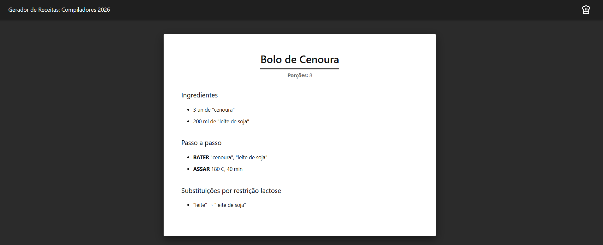
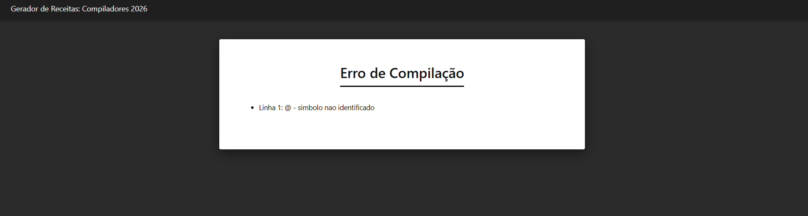

# Compilador de Receitas Culinárias

#### Disciplina
Compiladores — DC/UFSCar  
Professor: Daniel Lucrédio

#### Alunas
- Camila Oliveira de Souza — 800361
- Beatriz Ferreira Martins — 820565
- Yara dos Santos Rodrigues — 821774

---

## Descrição do Projeto

Este projeto consiste no desenvolvimento de um compilador para uma linguagem específica de domínio (DSL) voltada à descrição de receitas culinárias. A linguagem permite representar receitas de forma estruturada, com regras de substituição para restrições alimentares. O compilador realiza análise léxica, sintática e semântica sobre o arquivo de entrada e gera um documento HTML formatado com CSS externo.

---

## Referência da Linguagem (DSL)

### Estrutura Geral

```
RECEITA "Nome da Receita"
PORCOES: N
INGREDIENTES:
  ...
PASSOS:
  ...
FIM
```

### Cabeçalho

```
RECEITA "nome"
PORCOES: <numero>
```

O número de porções deve ser um inteiro maior que zero.

### Ingredientes

Cada ingrediente segue o formato:

```
<quantidade> <unidade> de "nome" [SUBSTITUIR <restricao> POR "substituto"];
```

- **Quantidade:** número inteiro
- **Unidades válidas:** `g`, `kg`, `ml`, `l`, `un`, `C`, `min`
- **Restrições válidas:** `vegano`, `vegetariano`, `lactose`, `gluten`
- A cláusula `SUBSTITUIR` é opcional e define uma regra de substituição condicional

### Ações

| Ação | Descrição |
|------|-----------|
| `MISTURAR` | Mistura ingredientes |
| `ADICIONAR` | Adiciona ingrediente |
| `ASSAR` | Assa a preparação (tempo/temperatura) |
| `BATER` | Bate ingredientes |
| `REFRIGERAR` | Refrigera a preparação |
| `COZINHAR` | Cozinha a preparação |

Cada ação recebe argumentos entre parênteses, separados por vírgula:

```
MISTURAR("farinha", "ovo");
ASSAR(180 C, 40 min);
```

---

## Arquitetura do Compilador

```text
Receita (txt)
 ↓
Análise Léxica (Lexer)
 ↓
Análise Sintática (Parser)
 ↓
Análise Semântica (Visitor + Tabela de Símbolos)
 ↓
Geração de HTML (Visitor + CSS Externo)
```

### 1. Análise Léxica
O lexer do ANTLR identifica os tokens da linguagem. Caracteres não reconhecidos ou strings não fechadas são detectados e reportados como erros léxicos, interrompendo a compilação.

### 2. Análise Sintática
O parser valida a estrutura gramatical da entrada conforme as regras da DSL. Caso a estrutura esteja incorreta, um erro sintático é reportado com a linha e o token problemático.

### 3. Análise Semântica
Um visitor percorre a AST e valida regras de negócio utilizando uma Tabela de Símbolos. As regras semânticas implementadas estão descritas na seção abaixo.

### 4. Geração de Código
Outro visitor traduz a AST para um documento HTML formatado, aplicando as substituições alimentares quando uma restrição é ativada. O HTML referencia um arquivo CSS externo (`estilos.css`) para estilização.

---

## Regras Semânticas

| # | Regra | Gatilho | Condição de Erro | Mensagem de Erro |
|---|-------|---------|-------------------|-------------------|
| 1 | Porções inválidas | `visitCabecalho` | Porções ≤ 0 | `quantidade de porcoes deve ser maior que zero` |
| 2 | Ingrediente duplicado | `visitIngrediente` | Ingrediente já declarado | `ingrediente X ja declarado` |
| 3 | Ingrediente não declarado | `visitPasso` | Ingrediente usado não consta na tabela | `ingrediente X nao declarado` |
| 4 | Ingrediente ocioso | `visitReceita` | Ingrediente declarado mas nunca usado | `ingrediente X foi declarado, mas nunca utilizado nos passos` |
| 5 | Restrição inválida | validação em `main` | Restrição passada no terminal não é reconhecida | `Restricao alimentar "X" nao reconhecida.` |

---

## Estrutura de Saída

O compilador gera um arquivo HTML formatado (`saida.html`) que contém:

- **Cabeçalho:** Nome da receita e quantidade de porções.
- **Ingredientes:** Lista formatada. Quando uma restrição alimentar é passada como argumento, as substituições correspondentes são aplicadas automaticamente.
- **Passos:** Lista numerada das instruções de preparo.
- **Relatório de Substituições** *(aparece apenas quando uma restrição é passada e há substituições aplicáveis):* Lista todas as substituições realizadas (ex: `"ovo" → "linhaça"`).

O HTML gerado depende do arquivo `estilos.css` no mesmo diretório de saída para a formatação correta.

---

## Pré-requisitos

- Java JDK 24
- Maven 3.9.x ou superior
- ANTLR 4.7.2 (gerenciado automaticamente pelo Maven)

---

## Compilação

No diretório onde se encontra o arquivo `pom.xml`, execute:

```bash
mvn clean package
```

---

## Execução

### Via Linha de Comando (Jar)

```bash
java -jar target/recipe-compiler-1.0-SNAPSHOT-jar-with-dependencies.jar entrada.txt saida.html [restricao]
```

### Via Maven

**Sem restrição:**

```bash
mvn exec:java -Dexec.mainClass=br.ufscar.dc.compiladores.receita.Principal -Dexec.args="entrada.txt saida.html"
```

**Com restrição:**

```bash
mvn exec:java -Dexec.mainClass=br.ufscar.dc.compiladores.receita.Principal -Dexec.args="entrada.txt saida.html vegano"
```

---

## Tratamento de Erros

O compilador reporta erros em três níveis:

- **Léxico:** Símbolos não reconhecidos ou strings não fechadas.
- **Sintático:** Estrutura gramatical fora das regras da DSL.
- **Semântico:** Inconsistências de dados conforme as 5 regras semânticas listadas acima.

Em caso de erro, a compilação é interrompida e o arquivo `saida.html` é gerado com a lista de erros. Em caso de sucesso, o arquivo é gerado com a receita formatada.

Ao final da execução será exibido:

```
Fim da compilacao
```

---

## Casos de Teste

O diretório `casos-de-teste/` contém 19 arquivos organizados por tipo de erro e funcionalidade:

| Caso | Arquivo | O que testa | Resultado Esperado |
|------|---------|-------------|-------------------|
| 01 | `01_valido.txt` / `01_invalido.txt` | Símbolo inválido (`@`) | Erro léxico |
| 02 | `02_valido.txt` / `02_invalido.txt` | String não fechada | Erro léxico |
| 03 | `03_valido.txt` / `03_invalido.txt` | `PORCOES` ausente | Erro sintático |
| 04 | `04_valido.txt` / `04_invalido.txt` | `FIM` ausente | Erro sintático |
| 05 | `05_invalido.txt` | Ponto e vírgula ausente | Erro sintático |
| 06 | `06_valido.txt` / `06_invalido.txt` | Ação inválida (`VOAR`) | Erro sintático |
| 07 | `07_valido.txt` / `07_invalido.txt` | Unidade inválida (`xyz`) | Erro sintático |
| 08 | `08_invalido.txt` | Restrição inválida (`teste`) | Erro sintático |
| 09 | `09_valido.txt` | Receita válida (sem restrição) | Sucesso |
| 09 | `09_invalidoD.txt` | Ingrediente duplicado | Erro semântico |
| 09 | `09_invalidoIND.txt` | Ingrediente não declarado | Erro semântico |
| 09 | `09_invalidoP.txt` | Porções igual a zero | Erro semântico |
| 10 | `10_valido_restricao.txt` | Substituição por restrição `lactose` | Sucesso |

---

## Exemplos

### Entrada

```text
RECEITA "Bolo de Chocolate"
PORCOES: 8
INGREDIENTES:
200 g de "farinha de trigo" SUBSTITUIR gluten POR "farinha de arroz";
3 un de "ovo" SUBSTITUIR vegano POR "linhaça";
100 g de "chocolate";
PASSOS:
MISTURAR("farinha de trigo", "ovo");
ADICIONAR("chocolate");
ASSAR(180 C, 40 min);
FIM
```

### Execução com restrição

```bash
mvn exec:java -Dexec.mainClass=br.ufscar.dc.compiladores.receita.Principal -Dexec.args="entrada.txt saida.html vegano"
```

Neste exemplo, o ingrediente "ovo" é substituído por "linhaça" na saída HTML, e o relatório de substituições exibirá:

```
Substituições por restrição vegano
  "ovo" → "linhaça"
```

### Exemplo de Saída (execução bem sucedida)



### Exemplo de Saída (erro)


